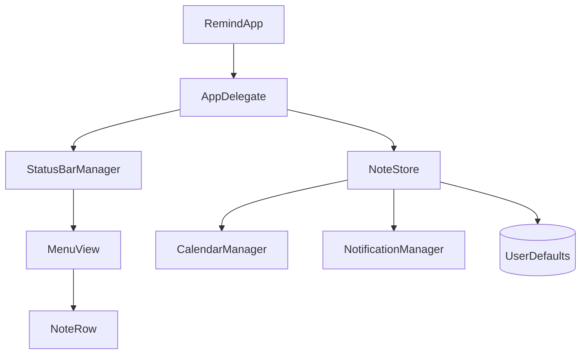

# Remind - Technical Documentation

## Architecture Overview

Remind is a macOS menu bar application built with **Swift** and **SwiftUI**. It follows a modular architecture to separate concerns between UI, persistence, and external system integrations (Calendar, Notifications).

### Component Design

#### 1. UI Layer (SwiftUI + AppKit)
- **StatusBarManager**: The bridge between AppKit's `NSStatusItem` and SwiftUI. It manages the popover life cycle and manages the enlarged popover frame (320x650) to accommodate the calendar.
- **MenuView & NoteRow**: Pure SwiftUI views. `MenuView` now includes a `.graphical` style `DatePicker` for the mini calendar view and localized empty state handling.

#### 2. Logic & Storage Layer
- **NoteStore**: The central state manager. It implements protocols for adding, updating, and deleting notes. It handles the "Sync with Calendar" trigger and pushes manual notes with due dates to the `CalendarManager`.
- **UserDefaults Persistence**: Notes are serialized to JSON and stored in `UserDefaults`.
- **Store Manifest (apps.json)**: A standard manifest for `wvw.dev` distribution, linking the GitHub repository, categories, and direct download links.

#### 3. System Integrations
- **CalendarManager (EventKit)**: Encapsulates all interactions with macOS Calendar. It handles permission requests, fetches meetings, and adds new events for manual reminders.
- **NotificationManager (UserNotifications)**: Schedules local notifications. It supports "Critical Alerts" for high-risk notes and handles interactive actions (Complete/Snooze) directly from the notification banner.

## Data Schema

### Note Model
| Property | Type | Description |
| :--- | :--- | :--- |
| `id` | `UUID` | Unique identifier for internal tracking. |
| `text` | `String` | The content of the reminder. |
| `risk` | `RiskLevel` | Urgency level (1-5), affects color and notification frequency. |
| `source` | `NoteSource` | `.manual` or `.calendar`. |
| `externalId` | `String?` | The `eventIdentifier` if sourced from Calendar (used for de-duplication). |
| `dueDate` | `Date?` | Specific time the reminder is due. |

### Risk Levels
- **1-2 (Low/Moderate)**: Standard reminders.
- **3 (High)**: Calendar events default level.
- **4-5 (Urgent/Critical)**: Triggers periodic nagging notifications every hour.

## Build Pipeline

The `build_remind.sh` script automates the production of a distributable macOS app.
1. Compiles the Swift package in release mode.
2. Constructs the `.app` bundle structure (`Contents/MacOS`, `Contents/Resources`).
3. Generates high-quality `.icns` files from `Remind_Icon.png`.
4. Performs an **Ad-Hoc Code Signing** to bypass simple Gatekeeper checks.
5. Packages the bundle into a Compressed DMG (`UDZO` format).
